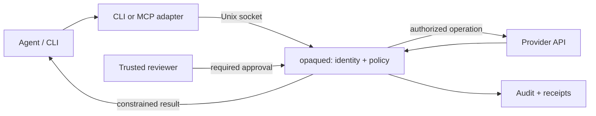

# Architecture

Opaque is a local authority broker for agent-driven work. The agent requests a permitted
operation; the broker checks authority, obtains required approval, uses the
credential and returns a constrained result. A useful first evaluation is one
repository operation, such as publishing a GitHub Actions secret, with a known
approver and an observable outcome.

This page describes source at
[83e7924](https://github.com/opaque-dev/opaque/tree/83e7924960f809e87379a54996317dbe1422fe70).
Source implementation does not establish availability in an installed release.
Check the selected version and the capability-specific qualification requirements.

The [scoped authority foundation](scoped-authority.md) is a separate, unreleased
library path for finite delegated work. It is not wired into the execution paths
described below.

## Request flow

The broker prepares the effective target, parameters and credential references
before review. Policy, approval and execution use that captured action; secret
values are resolved only after authorization. Current policy and requester
authority are checked at the dispatch boundary. Revocation cannot undo an already
authorized provider effect.

The daemon is the enforcement point. CLI, MCP and the read-only local dashboard
are interfaces to it. See [operation contracts](operations.md) and
[reusable core](reusable-core.md) for implementation boundaries.

## Trust boundaries

The agent, its dependencies and its commands are untrusted. The broker, its
administrators, credential stores and enrolled approval keys remain trusted.
Opaque does not prevent an agent from exfiltrating credentials it can read through
another path or using a separate credential to bypass the broker.

**Custody is a deployment requirement.** Default session mode shares the user's
identity; a process with access to the broker's keys can compromise its controls
and forge locally valid audit history. Enforced trust-domain separation puts
configuration, keys and authoritative state under a separate service account or
container. Startup checks custody permissions. Follow [deployment](deployment.md)
for that boundary; a separate directory under the same account is insufficient.

Socket peer credentials and executable identity constrain clients. They do not
prove a human is present: an agent can invoke the CLI. Verified delegated identity
and current role/session state provide additional authority checks. See
[identity](identity.md) and [policy](policy.md).

## What approval authorizes

| Path | Approved scope and consumption |
| --- | --- |
| **Generic operation** | One prepared action. The operation's minimum approval requirement and policy determine the gate. First-use leases bind client, target, references, parameters and any verified delegation; a lease can permit repeated matching operations until expiry. |
| **Bounded task** | An immutable manifest reviewed in full through local native review or, for supported families, a paired workstation. Each action consumes a durable attempt before dispatch. Changed work requires a new task and review. |
| **Third-party MCP invocation** | One invocation UUID under a signed route, pinned upstream schema and finite admitted arguments. Requires local native full review and a separate durable attempt. A workstation task approval does not authorize MCP. |

Task and MCP failures, interruption and unknown outcomes do not refund consumed
attempts. Inspect or reconcile before proposing new work. Required approval fails
closed if no supported factor is available. Read [bounded work](bounded-work.md),
[workstation review](remote-approvals.md) and [MCP qualification](mcp-qualified-tools.md)
for exact supported contracts.

## Output and execution limits

Brokered operations keep credentials outside the agent's process. Response
sanitization is enforced in code; pattern scrubbing does not prove all output
harmless. MCP registry v2 can disclose signed selections of bounded integer/status
fields after a current-authority check; those values remain untrusted provider
claims. Arbitrary upstream text is withheld.

`opaque exec` instead injects secrets into a child process. Its Linux/macOS sandbox
is a compatibility control, not a confidentiality guarantee when the agent chooses
the command.

## What the evidence supports

Audit chaining and authenticated heads detect covered tampering when the attacker
lacks the HMAC key. Portable signed checkpoints bind an enrolled producer to exact
export bytes and a declared range, without sharing that key. An older intact
snapshot remains valid: the receiver must retain continuity and high-water state.

Receipts describe observed outcomes. API acceptance does not prove a deployment
succeeded; a charged attempt does not prove a write occurred. Signatures do not
prove an honest producer, independent custody or globally complete history. See
[evidence checkpoints](evidence-checkpoints.md), including older-store migration.

## Inspect and qualify

Start with these source and test anchors at the revision above:

- [Generic enforcement](https://github.com/opaque-dev/opaque/blob/83e7924960f809e87379a54996317dbe1422fe70/crates/opaqued/src/enclave.rs): preparation, approval leases and dispatch checks.
- [GitHub secret-write fixture](https://github.com/opaque-dev/opaque/blob/83e7924960f809e87379a54996317dbe1422fe70/crates/opaqued/tests/provider_e2e.rs): broker dispatch to a mocked GitHub endpoint and checks that the response omits the secret and token.
- [Task ledger tests](https://github.com/opaque-dev/opaque/blob/83e7924960f809e87379a54996317dbe1422fe70/crates/opaque-bounded-work/src/task_store.rs): concurrent consumption, revocation and interrupted-attempt recovery.
- [MCP integration tests](https://github.com/opaque-dev/opaque/blob/83e7924960f809e87379a54996317dbe1422fe70/crates/opaqued/tests/mcp_gateway_e2e.rs): mocked effects, denied dispatch, restart replay rejection and withheld disclosure.
- [Audit regression tests](https://github.com/opaque-dev/opaque/blob/83e7924960f809e87379a54996317dbe1422fe70/crates/opaque-core/src/audit/regression_tests.rs): tampered storage, retention and durability faults.

These are implementation evidence, not an independent security audit or customer
production validation. Qualify actual credentials, provider behavior, reviewer
installation, custody and bypass paths for the chosen workflow. Platform packaging
and source tests do not qualify every feature on every platform.

For broader configuration, continue to [operations](operations.md),
[federation](federation.md) or [deferred capabilities](roadmap-deferred.md).
