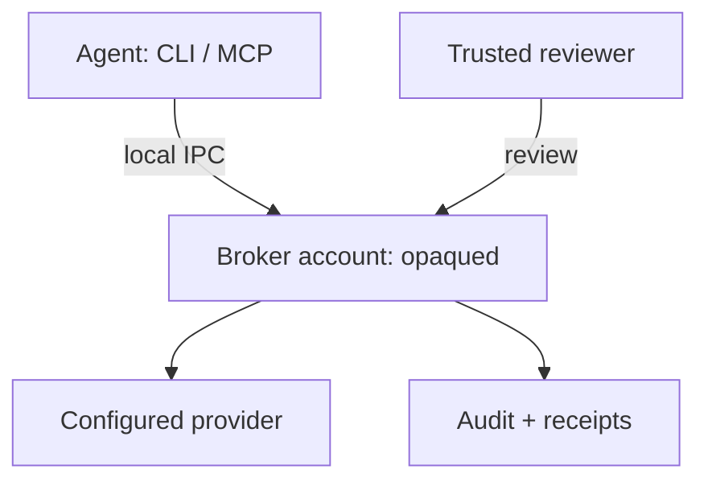
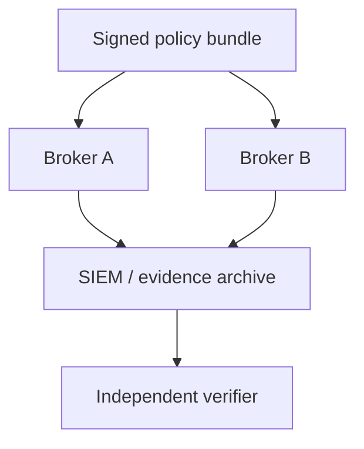

# Choose an agent security deployment pattern

Use one broker to gate a local workflow, or multiple brokers with common signed
policy and audit export. These patterns use public core v0.6.0 on macOS or Linux.

| Pattern | Use it for | Required boundary |
| --- | --- | --- |
| Same-account local broker | Learn the request, review and audit workflow | Disposable credentials and data; agent and broker share custody access |
| Broker under a separate identity | Gate actions from an untrusted agent account | Broker-owned configuration, keys and durable state; authenticated socket access; a trusted reviewer |
| Multiple brokers with signed policy | Apply common rules and collect evidence across hosts | Separate custody on every host; enrolled policy keys; independently retained evidence |

## One isolated broker



The broker captures the requested action, checks current authority, obtains the
applicable approval and dispatches through its configured provider. Task and MCP
attempts are reserved durably before dispatch; interruption does not restore an
attempt. Revocation ordered before the final dispatch fence blocks that dispatch.

Use the [deployment guide](deployment.md) to establish custody and socket
permissions. A separate directory under the agent's account does not isolate
keys. Review the provider credential and consuming workflow too; Opaque governs
only actions routed through its broker.

The [request-path comparison](architecture.md#what-approval-authorizes) distinguishes
ordinary operations, immutable tasks and signed third-party MCP invocations.
[Scoped authority](scoped-authority.md) has a separate bounded-budget execution path.

## Multiple brokers



Configure each broker with the policy publisher's public trust anchor. Brokers
verify bundles, reject version rollback and apply the signed rules locally.
Export audit records by spool, HTTPS webhook or TLS syslog. Delivery is
at-least-once; the receiver deduplicates records and retains continuity state.

```sh
opaque bundle verify policy.bundle --anchor <policy-key-hex>
opaque attest --key <broker-attestation-key-hex>
```

Follow [signed policy and export configuration](federation.md). Sequence numbers
and record hashes support comparison with the source; independent producer
verification requires [signed checkpoints and enrolled keys](evidence-checkpoints.md).
A software posture report authenticates the enrolled signer's claims, not a
hardware measurement or globally complete history.

## Application and enterprise integration

Tenant-bound inference requires a configured model/source profile and admitted
identity. The broker does not provision the IdP or infer customer membership from
a caller's fields. Use [identity](identity.md), [public CI inference](github-ci-inference.md)
and [bounded tasks](bounded-work.md) for the supported operation contracts.

Public libraries and provider-neutral protocols can be consumed without private
source or enterprise credentials. See [build with the core](reusable-core.md).
SCIM adapters, collaboration delivery, fleet collection, management views and the
Kubernetes operator belong to the separate enterprise repository. Their
availability is independent of a core release.
